# План рефакторинга архитектуры VPN Сервиса (Мастер-план)

Этот документ является **единым источником правды (Single Source of Truth)** для рефакторинга legacy-скрипта Telegram-бота в профессиональную, масштабируемую и задокументированную систему корпоративного уровня (Enterprise-grade). 

Новая архитектура спроектирована с учетом будущего создания веб-версии сервиса (дашборда), а также учитывает все нюансы бизнес-логики, биллинга и продвинутого мониторинга.

---

## 1. Топология сети (Server Architecture)

Мы уходим от монолитного запуска бота и VPN-контейнеров на одном сервере. Система физически разделена на управляющий центр и «умные» рабочие ноды (Smart Agents).

* **Центральный сервер (Управляющий):** Здесь работают База Данных, Redis, ядро FastAPI, Telegram-бот (в том же контейнере что и FastAPI), фоновые задачи (Cron/Celery) и документация.
* **VPN-сервера (Рабочие ноды):** На каждом сервере установлен легковесный агент (FastAPI). 
  * **Smart Agent (Stateless):** Агент не имеет собственной базы данных и не хранит состояния (Stateless). Центральный сервер управляет пулом IP-адресов и UUID, генерирует криптографические ключи и отправляет агенту уже готовые данные (например, X25519 ключи или `UUID`). Агент лишь добавляет их в конфигурацию (AmneziaWG/Xray) "на лету" (Hot-Reload через `wg syncconf` и `xray api gRPC`) без перезапуска самих служб, чтобы не рвать текущие сессии пользователей.
  * **Трехслойная защита API нод:** HTTPS (Caddy/Nginx) ➔ Статический Bearer Token ➔ IP Whitelisting (ufw пропускает пакеты только от IP Центрального сервера). Никакого прокидывания `docker.sock`!
* **Синхронизация состояний (Reconciliation):** PostgreSQL — единственный источник правды. Если при запросе к ноде сеть моргнула, ключ сохраняется в БД со статусом `pending_sync`. Фоновая задача (Reconciliation Job) "досылает" конфигурацию на ноду, обеспечивая Eventual Consistency.

---

## 2. Базы данных и Хранение

* **PostgreSQL:** Единый источник правды. Полный отказ от SQLite. Начинаем с чистой базы данных. ORM: SQLAlchemy 2.0 (asyncpg) + Alembic.
* **Безопасность БД:** Конфиденциальные данные (в частности `KEYS.config_data`) обязательно шифруются алгоритмом симметричного шифрования (например, Fernet) перед сохранением в базу, чтобы администратор сервера не имел доступа к чужим ключам. Поля сумм транзакций (`amount`) хранятся строго в формате BIGINT (в копейках), чтобы избежать ошибок округления FLOAT.
* **Redis (In-Memory Data Store):** Критически важный компонент для работы FastAPI в несколько воркеров. Используется для:
  * Хранения состояний Telegram-бота (FSM aiogram).
  * Rate-Limiting и троттлинга системных алертов.
  * Работы брокера сообщений для фоновых задач (например, arq/Celery), чтобы задачи (удаление ключей, синхронизация) не дублировались при многопоточности.
* **Автоматические бэкапы (S3):** Для защиты данных поднят отдельный backup-контейнер (например, `prodrigestivill/postgres-backup-local`), который ежедневно делает дамп PostgreSQL и отправляет его в защищенное S3-облако (AWS/Yandex/Selectel).
* **Абстракция серверов (Бесшовный Failover):** Для подключения (Endpoint) в клиентских конфигах используются **доменные имена** через Cloudflare (например, `nl-1.myvpn.com`), а не сырые IP-адреса. В случае блокировки сервера РКН, администратор меняет A-запись домена. Клиенты автоматически подключаются к новому серверу **без необходимости перевыпускать ключи**.

---

## 3. Архитектура приложения (Layered Architecture)

Приложение разбито на независимые слои (Clean Architecture), чтобы отвязать бизнес-логику от Telegram или HTTP.
* **Data Layer (Repositories):** Классы для работы с БД (например, `UserRepository`). Вся SQL-логика инкапсулирована здесь.
* **Business Logic Layer (Services):** Ядро приложения (`VpnManagerService`, `BillingService`).
* **Transport Layer & Presentation (Интерфейсы):**
  * **FastAPI (Ядро):** Экспонирует REST API. Это центральный узел, к которому подключаются все клиенты: ноды, Telegram-бот, Telegram Web App и внешний сайт.
  * **Aiogram (Бот):** Обрабатывает классические текстовые команды (`/start`) и Inline-кнопки.
  * **Telegram Web App (Mini App):** Встроенный в Telegram веб-интерфейс (Frontend) для более удобного управления ключами и подписками.
  * **Standalone WEB Dashboard:** Полноценный внешний сайт (Frontend-приложение), где пользователи могут авторизоваться (например, через Telegram Login), оплачивать тарифы, генерировать ключи и смотреть статистику через браузер, не заходя в Telegram.

---

## 4. Мониторинг и Observability (Grafana Cloud)

* **Grafana Alloy (All-in-One):** Единый бинарный агент для всех машин. Полностью заменяет зоопарк отдельных экспортеров. Он берет на себя:
  * *Сбор логов (Loki):* Отправляет в облако логи уровня `INFO` и выше, а также стэктрейсы из кастомного обработчика исключений бота.
  * *Метрики железа (Node Exporter):* Загрузка CPU, Memory Usage, Disk Space.
  * *Доступность извне (Blackbox Exporter):* Пинги HTTP Healthcheck эндпоинтов, SSL Expiration, DNS Resolution.
  * *Сетевые метрики:* Входящий/исходящий трафик, Packet Loss, Active Tunnel Connections и мониторинг подозрительной активности.
* **Бизнес-метрики:** Alloy забирает бизнес-метрики у FastAPI (эндпоинт `/metrics` жестко закрыт паролем через HTTP Basic Auth). Данные по гигабайтам трафика **не пишутся** в БД (чтобы не перегружать транзакционную базу), всё уходит только в Prometheus.
* **Алерты в Telegram:** Обработчик ошибок шлет стэктрейсы в админ-чат (с защитой от спама через Redis).

---

## 5. Продукт и Бизнес-логика

### 5.1. Тарифы и Устройства
* **Триал:** При активации автоматически дается 3 дня тестового периода.
* **Базовый:** 70₽/мес или 600₽/год.
* **Премиум:** 129₽/мес или 999₽/год.
* **Лимиты устройств:** Ориентировочно — 3 ключа максимум. При оформлении подписки бот автоматически генерирует ключи на выбранной локации.
* **Докупка ключей:** Предусмотрен функционал докупки ключей пользователем сверх лимита.

### 5.2. Защита от Abuse и Сетевая Безопасность
У нас полный безлимит по объему гб, но с мощной защитой инфраструктуры:
* **Собственный DNS (Unbound):** На каждой VPN-ноде разворачивается локальный кэширующий DNS-сервер (Unbound). В сгенерированных конфигах в качестве DNS прописывается внутренний IP ноды. Это на 100% защищает от **DNS Leaks** и слежки со стороны провайдера.
* **Блокировка P2P и Спама:** Торрент-протоколы режутся на уровне фаервола ноды или конфигурации Xray. Исходящий **Порт 25 (SMTP) жестко заблокирован** для предотвращения почтового спама.
* **Лимит сессий:** Жесткий контроль на ноде: не более разрешенного числа одновременных подключений на юзера.
* **QoS (Разница тарифов):** Если сервер перегружен, Smart-агент автоматически урезает скорость (динамический шейпинг через утилиту Linux `tc`) **только** для пользователей Базового тарифа. Премиум работает всегда на максимуме.

### 5.3. Платежные методы и Возвраты
* **Эквайринг (High-Risk Агрегаторы):** Используются специализированные агрегаторы (AAIO, Payok, Lava). Они лояльны к VPN, принимают МИР, СБП, QIWI и имеют низкий минимальный порог чека (от 10 рублей).
* **Полуавтоматические возвраты (/refund):** Бот рассчитывает сумму возврата по остатку дней, отзывает ключи и создает "Тикет". Админ вручную возвращает деньги через панель агрегатора и закрывает тикет в боте (при переводе тикета в `processed`, статус в таблице `PAYMENTS` автоматически меняется на `refunded`).
* **Промокоды и Апгрейды:** Встроенная система скидок (до 100%). При переходе с Базового на Премиум бот пропорционально рассчитывает доплату за оставшиеся дни.

### 5.4. Взаимодействие с пользователем (Омниканальность)
* **Язык интерфейса:** Бот и веб-интерфейсы работают строго на **русском языке**. Мультиязычность (i18n) не используется для упрощения кодовой базы, тексты вынесены в отдельный файл констант.
* **3 версии интерфейса в Telegram:**
  1. **Команды:** Классический текстовый ввод (`/start`, `/help`, `/subscribe`).
  2. **Кнопки:** Удобная навигация через Inline и Reply клавиатуры.
  3. **Telegram Web App (TWA):** Современный Mini App внутри Telegram с красивым UI для покупки подписки и генерации ключей в один клик.
* **Внешний WEB-сайт:** Отдельный личный кабинет пользователя в браузере. Позволяет управлять аккаунтом тем, кто не хочет или не может использовать Telegram-клиент в данный момент. Доступны все те же функции (биллинг, ключи, промокоды) благодаря единому FastAPI бэкенду.

### 5.5. Админ-панель и Модерация (/admin)
* **Безопасность:** Доступ к админке выдается строго через хардкод Telegram ID в файле `.env` (`ADMIN_IDS=123,456`), что исключает несанкционированный доступ через БД.
* **Модерация:** Ручное удаление ключей и полная блокировка по ID/Username (`/ban`).
* **Конструктор промокодов:** Создание кодов с заданным % скидки и количеством активаций.
* **Выпуск и Перегенерация:** 
  * Ручная генерация нового конфига.
  * "Перегенерировать @username" — точечный перевыпуск и отправка ключей конкретному юзеру.
  * "Перегенерировать всем" — массовый перевыпуск для всей базы (спасение при глобальных сбоях на нодах).

### 5.6. Реферальная система и Жизненный цикл
* **Реферальная система:** За каждого оплатившего друга реферер получает **+30 бонусных дней**, а реферал **+7 дней**. Бонус рефереру начисляется строго один раз при первом успешном платеже друга (контролируется флагом `ref_bonus_triggered` в таблице `USERS`).
* **Контроль подписок (Redis Worker):** 
  * За 3 дня до конца подписки отправляется напоминание. 
  * После истечения подписки дается **Grace Period (24 часа)**, по истечении которого ключи окончательно удаляются с VPN-нод.

---

## 6. Документация и QA (Тестирование)

* **Автотесты:** Обязательное покрытие кода автоматическими тестами (pytest) всех критических бизнес-процессов (выписка ключей, биллинг, реферальная логика) в разумных рамках.
* **Docs-as-code:** Вся документация генерируется из кода:
  * **Движок:** MkDocs с темой Material. Исходники лежат в папке `docs/` (в Markdown).
  * **API Документация (Swagger):** Интерактивный Swagger интегрирован прямо в страницы MkDocs (плагин `mkdocs-swagger-ui-tag`).
  * **Схема БД:** Структура PostgreSQL описывается на языке DBML в `docs/schema.dbml` для автогенерации ER-диаграмм (карт базы данных).

---

## 7. Развертывание (Deployment & CI/CD)

Вся инфраструктура разворачивается с помощью **Docker и Docker-Compose**.
* **CI/CD (GitHub Actions / GitLab CI):** При пуше в ветку `main` запускается автоматическая сборка Docker-образов (Центральный сервер, Smart Agent). Образы пушатся в защищенный Container Registry (GHCR/Docker Hub).
* **Деплой:** На серверах выполняется только `docker pull` и перезапуск контейнеров, без необходимости тяжелой локальной сборки.
* Центральный сервер поднимает базу PostgreSQL, Redis, FastAPI-ядро и Cron-воркеры в едином docker-compose стеке.
* На VPN-нодах Агент поднимается в Docker-контейнере, внутрь которого прокидывается сокет Docker (`/var/run/docker.sock`), чтобы Агент мог управлять локальными VPN-контейнерами (AmneziaWG/Xray).

---

## 8. Визуализация архитектуры (Схемы)

Ниже представлены ключевые схемы проекта.

### Схема общей архитектуры (Component / System Architecture)

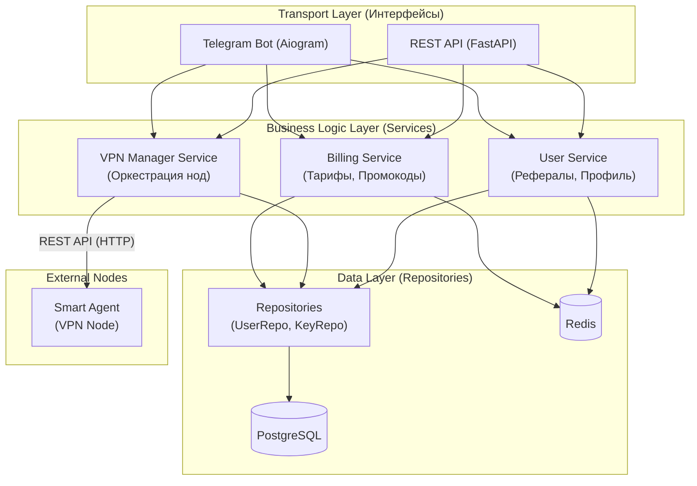

### Сетевая инфраструктурная схема (Deployment & Network Diagram)

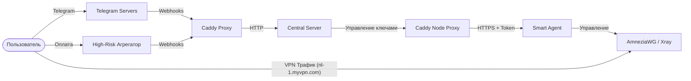

### Топология сети (Server Architecture)

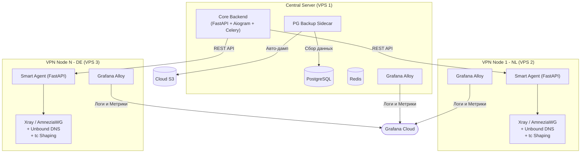

### Диаграмма последовательности для биллинга (Sequence Diagram: Purchase & Referral)

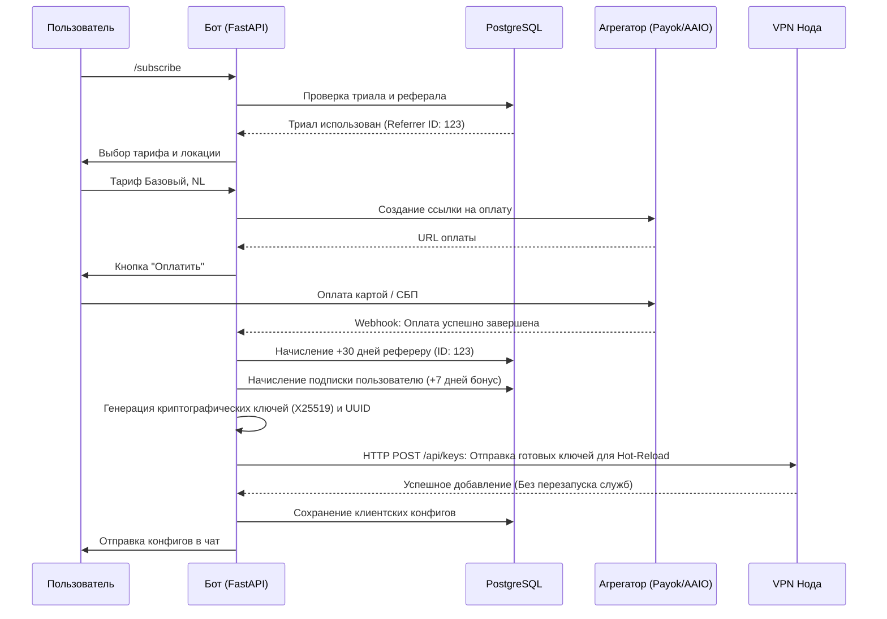

### ER-диаграмма базы данных (Database Schema)

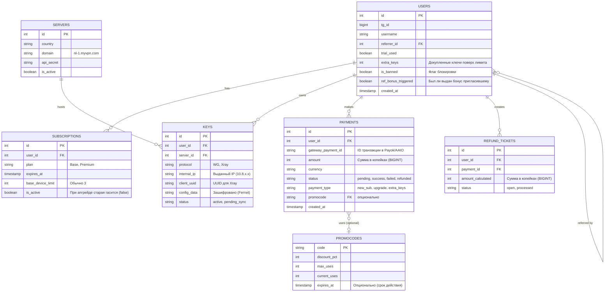

### Файловая архитектура для кода (Clean Architecture)

```text
vpn-telegram-bot/
├── app/
│   ├── api/                 # FastAPI роутеры (эндпоинты REST)
│   │   ├── dependencies.py
│   │   └── routes/
│   ├── bot/                 # Хендлеры aiogram (интерфейс Telegram)
│   │   ├── handlers/
│   │   ├── keyboards/
│   │   └── middlewares/
│   ├── core/                # Конфигурация (Pydantic settings, логирование)
│   │   ├── config.py
│   │   └── security.py
│   ├── db/                  # База данных
│   │   ├── migrations/      # Alembic миграции
│   │   ├── models/          # SQLAlchemy модели таблиц
│   │   └── repositories/    # Паттерн Repository для изоляции SQL
│   ├── services/            # Бизнес-логика (не зависит от API или Бота)
│   │   ├── billing.py
│   │   ├── vpn_manager.py
│   │   └── users.py
│   ├── tasks/               # Фоновые джобы (Redis/Celery/arq)
│   └── main.py              # Точка входа (Инициализация FastAPI и Бота)
├── docs/                    # Документация (MkDocs)
│   ├── schema.dbml
│   └── план рефактора.md
├── smart_agent/             # Код легковесного агента для нод (FastAPI)
│   ├── api/                 # Эндпоинты (keys.py, stats.py)
│   ├── services/            # Интеграция с VPN (awg_manager.py, xray_manager.py)
│   ├── core/                # Конфигурация и безопасность
│   ├── schemas/             # Pydantic схемы
│   └── main.py              # Точка входа агента
├── tests/                   # Автотесты (pytest)
├── .github/workflows/       # CI/CD пайплайны
├── docker-compose.yml       # Инфраструктура центрального сервера
└── requirements.txt         # Зависимости Python
```

### Примерный вид Grafana

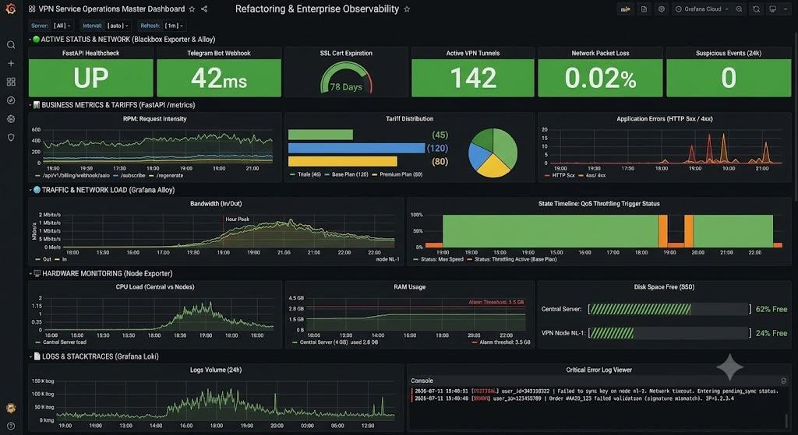

### Сервис на языке бизнеса

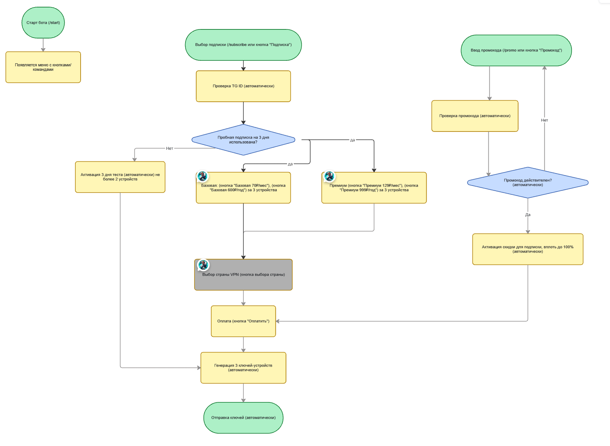
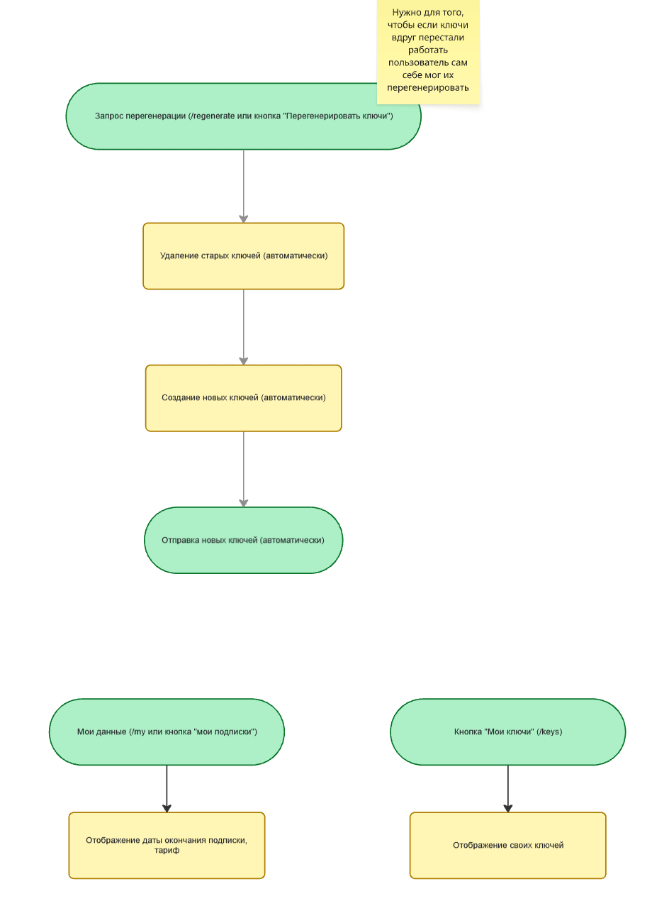
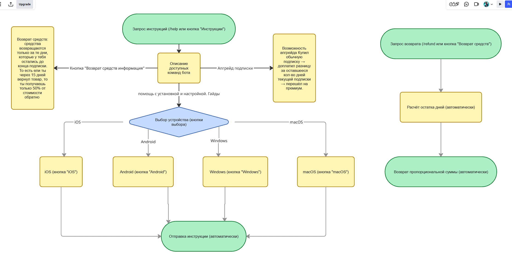
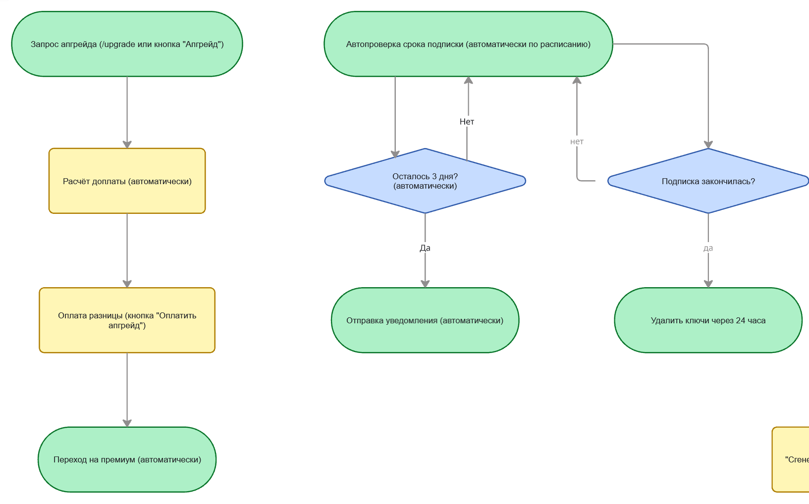
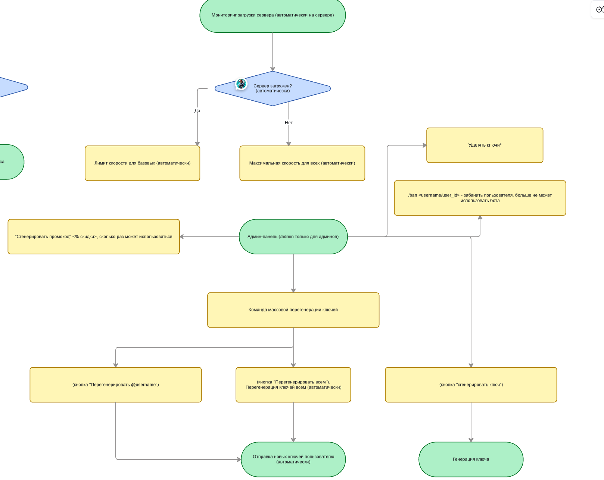
